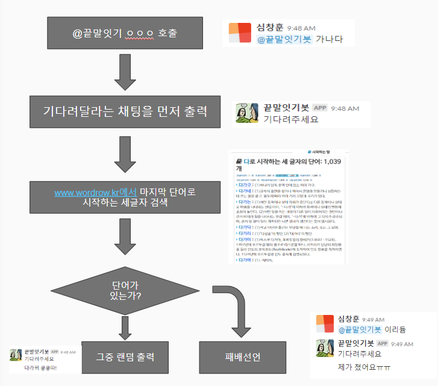

# 커스텀 챗봇

파이썬 Flask사용 
Flask : 웹 어플리케이션을 만드는 마이크로프레임워크(microframework)

* 만든거

slack api기반? 봇 만듬
slack 채팅방에 @끝말잇기봇
www.wordrow.kr 에서 단어 크롤링 

세글자 끝말잇기 지원하고 검색결과 없으면 패배선언, ooo뭐야 라고 검색시 해당단어 설명

소스는 https://github.com/SimChangHun/chat_bot v4
